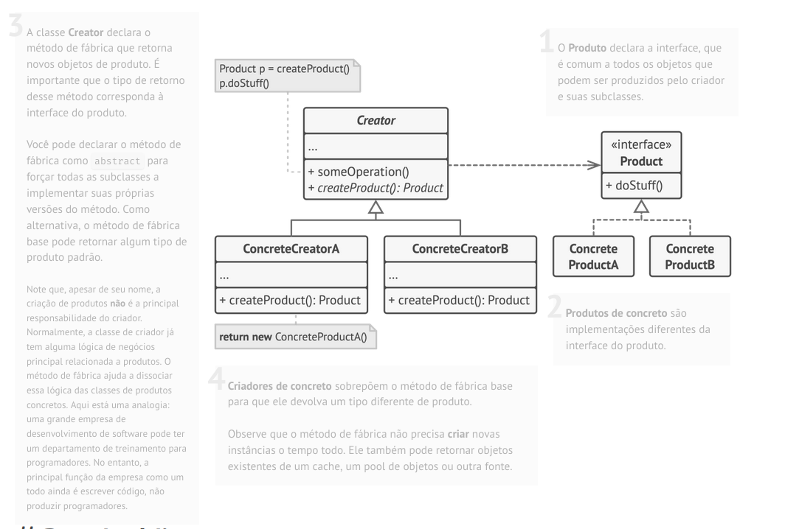

# Padrão Criacional: Factory Method

## 1. O Problema
Imagine que você está desenvolvendo um aplicativo de **Gestão Logística**. Na primeira versão, o app lidava apenas com transporte terrestre via **Caminhões**. Por isso, todo o código estava fortemente acoplado à classe `Truck`.

Com o sucesso do app, surgiram demandas para integrar transporte marítimo (**Navios**). O problema é que a arquitetura atual exigiria refazer toda a lógica principal para aceitar a nova classe `Ship`, criando condicionais complexas (`if transport == 'Truck' ... else if 'Ship' ...`). Se no futuro precisarmos adicionar **Aviões**, teríamos que quebrar o código novamente.

## 2. A Solução (Factory Method)
O padrão **Factory Method** sugere substituir a criação direta de objetos (usando o operador `new` diretamente na lógica de negócio) por chamadas a um método especial chamado *fábrica*.

As subclasses da classe criadora podem sobrescrever esse método fábrica para alterar a classe do objeto que será criado. Dessa forma, a lógica de negócio (o código cliente) não precisa saber se está lidando com um Caminhão ou um Navio; ela apenas sabe que tem um objeto `Transporte` que possui o método `entregar()`.

## 3. Estrutura do Padrão

A imagem abaixo ilustra o conceito geral do padrão, conforme catalogado pelo Refactoring Guru:



### Aplicação na Implementação C++

Neste repositório, implementamos a estrutura clássica e abstrata do padrão para demonstrar o polimorfismo em C++. Abaixo, o mapeamento entre a Teoria (Logística) e o Código (Genérico):

| Papel no Padrão | Classe no Código C++ | Analogia (Exemplo Logística) |
| :--- | :--- | :--- |
| **Product (Interface)** | `Product` | Interface `Transporte` |
| **Concrete Product** | `ConcreteProduct1` / `2` | Classes `Caminhao` e `Navio` |
| **Creator (Abstrato)** | `Creator` | Classe Base `Logistica` |
| **Concrete Creator** | `ConcreteCreator1` / `2` | `LogisticaViaria` e `LogisticaMaritima` |

## 4. Detalhes da Implementação (C++)

O código em `codigo/factory_method.hpp` demonstra um recurso poderoso deste padrão: **A Lógica de Negócio Reutilizável**.

Diferente do que muitos pensam, a classe `Creator` não serve apenas para criar objetos. Ela geralmente contém a lógica de negócio principal que **depende** do produto criado.

Observe o método `SomeOperation()` na classe `Creator`:

```cpp
std::string SomeOperation() const {
    // 1. A classe Pai pede para criar um produto, mas não sabe QUAL é.
    // (O filho decidirá isso dinamicamente graças ao 'virtual')
    Product* product = this->FactoryMethod();
    
    // 2. A classe Pai usa o produto através da interface comum.
    std::string result = "Creator: O mesmo codigo funcionou com -> " + product->Operation();
    
    delete product; // Gerenciamento de memória
    return result;
}
```